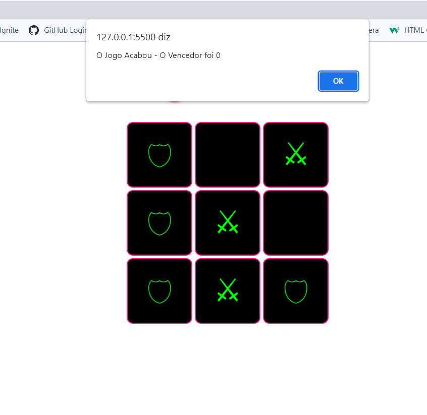

><h1>Jogo-da-Velha</h1>

<h2 align="center">
  Acesse o Jogo-da-velha Clicando <a target="_blank" href="https://erick-sarges.github.io/Jogo-da-Velha/">AQUI</a>!
</h2>

 

  <a href="#clipboard-sobre-o-projeto">Sobre o Projeto</a>&nbsp;&nbsp;&nbsp;|&nbsp;&nbsp;&nbsp;
  <a href="#computer-tecnologias-utilizadas">Tecnologias</a>

## :clipboard: Sobre o Projeto

Jogo da velha simples, para os amantes de jogos retrô.

## :computer: Tecnologias utilizadas
O projeto foi desenvolvido utilizando as seguintes tecnologias:
- <b>HTML</b>
- <b>CSS</b>
- <b>JAVASCRIPT</b>